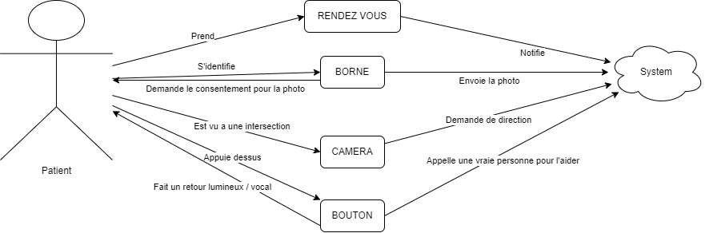
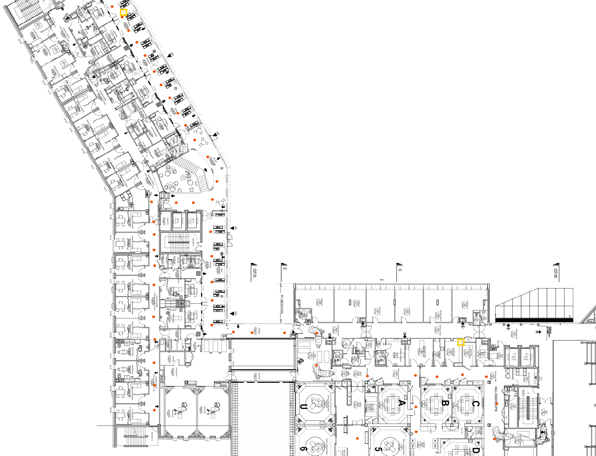
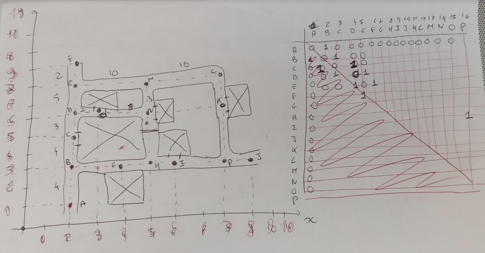

# facial-recognition

Run `py main.py`

### Use cases

### Schéma technique général

### Database schema

### Algorithme détection d'une personne par une caméra

### Algorithme pour trouver le chemin d'un point à un autre

> node put on the hospital mal

> matrice node position

